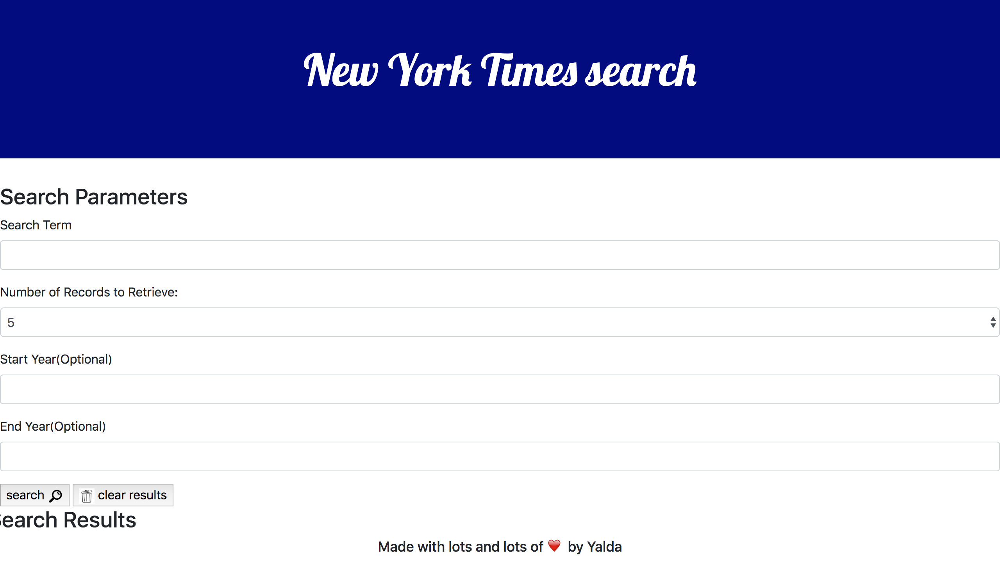

# New York Times activity

## Search a keyword in certain time period in years ,for articles in NYT
This application is using the API from New York Times and is giving the ability to search for a keyword. It will then give the user articles based on their searched keyword.

## Screen Shot

## Installation
To use this app you can click : [here](https://zahraaliaghazadeh.github.io/nytactivity/)

## Usage
In order to use this application you can open the link, then you can enter the keyword you are searching for, as well as the range of the year. You can choose the number of articles you would want and click on seach button. It will then populate the results below the search results. you can clear the search by clicking the clear button.

## credits
styling by bootstrap : [bootstrap](https://getbootstrap.com/)

API from : [NewYorkTimesArticleSearch](https://developer.nytimes.com/docs/articlesearch-product/1/overview)

## Contact
Email: zahraaliaghazadeh@gmail.com

LinkedIn: [LinkedIn](https://www.linkedin.com/in/yalda-aghazade-7a9b0390)

## Licence
MIT license
copy right ©Zahra Ali Aghazadeh
